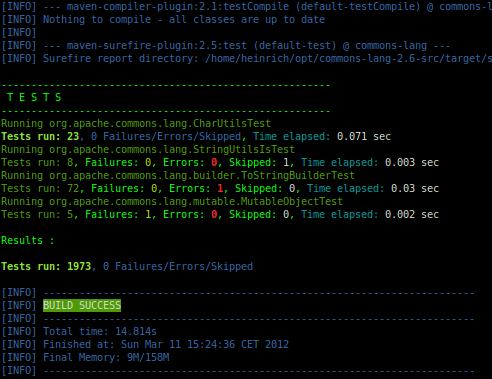

# entintar

This is a small tool to colorize and filter the verbose output of Maven or other unreadable text output.

Does not work with DOS/Windows Command Box (cmd.exe) - use Cygwin instead.

## The name?

'entintar' is Spanish and AKFAIK means something like ink or colorize. Colorizer was already used.

## Usage

```
Usage: node ./bin/entintar [options]

Options:
  --encoding, -e  character-set of stdin input                 [default: "utf8"]
  --logfile       path/name of file where stdin is written to  [default: null]
  --color         colorize output (--no-color to disable)      [default: true]
  --rules         name of rule-set or path to rules.js         [default: "maven3"]
  --debug         output for easier debugging                  [default: false]
  --help, -h      show help and exit
```

## Use with maven

Install entintar globally:

    npm install entintar -g

Place following lines in your ~/.bashrc:

```bash
mvn_colored() {
    $MAVEN_HOME/bin/mvn $* | entintar
    # $MAVEN_HOME/bin/mvn $* | entintar --logfile mvn.log
}
alias mvn=mvn_colored
```

If you want to run the maven command w/out coloring, then run

    "mvn" ...

This will ignore the bash alias and directly run the mvn command.

## Example Output



## Extend

You can easily extend this tool by providing a rules.js (see lib/rules/maven3.js for an example).
If placed in the same directory, you can select the rules with the command line option --rules and the name
w/out '.js'.
It is also possible to place a rules file elsewhere and provide the full path to this file.

## TODO

  * Refactor (especially index.js is kind of spagetti-code)
  * Write a real test (not just invoke the program)

## License

MIT (see LICENSE file)
